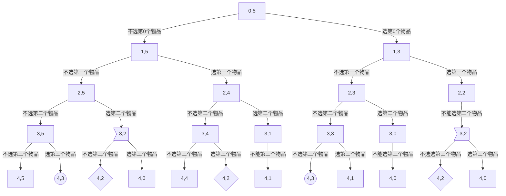

[TOC]

# 背包问题

## 01背包问题

> 有n个重量和价值分别为w~i~，v~i~的物品，从这些物品中挑选出总重不超过W的物品，求所有挑选方案中价值总和的最大值
>
> $1\leq n \leq 100$
>
> $1\leq w_i,v_i \leq 100$
>
> $1\leq W \leq 10000$
>
> ```c++
> //输入
> 4 5
> 2 3
> 1 2
> 3 4
> 2 2
> //输出
> 7
> ```
>
> 

### 引入：dfs深搜

#### 算法思想

最朴素的方法，**dfs**

**第i个物品开始挑选，选择的物品总重不超过j的最大价值（这里的最大值实际上在res中体现）**<!--res在代码中有解释-->

对于每一个物品，有两种选择：**要or不要,**

#### 代码

```c++
#include<iostream>
using namespace std;

const int maxn=105;
int n,W;
int w[maxn],v[maxn];

int dfs(int i,int j){//从第i个物品开始挑选，选择的物品总重不超过j
    int res;//从第i个物品开始挑选，选择的物品总重不超过j的最大价值
    if(i==n){//当i=n时，所有物品都搜索过了，已经dfs到底了，返回0
        res=0;
    }else{
        if(j<w[i]) res=dfs(i+1,j);//j<w[i]，此物品无法选择，直接搜索下一个物品
        else res=max(dfs(i+1,j),dfs(i+1,j-w[i])+v[i]);//否则，此物品可以选择，不要和要都dfs尝试一下，返回最大值
    }
    return res;
}

int main(){
    cin>>n>>W;
    for(int i=0;i<n;i++){
        cin>>w[i]>>v[i];
    }
    cout<<dfs(0,W)<<endl;
}
```


#### 复杂度

dfs的深度是n，每层有两个分支，复杂度为**O($2^n$)**

当n较大时就无法解决问题了


### 记忆化搜索

#### 算法思想

来看看dfs的过程



看图中标出的几处

dfs(3,2)、dfs(4,2)、dfs(4,3)....

这些在搜索过程中不只出现了一次，也就是说，dfs(i,j)会对已经搜索过的==重复搜索==

明明搜索过一次dfs(i,j)后我就已经知道结果，为啥还去在**重复搜索**那么多次呢

因此，我们把第一次搜索到的结果==记下来==

也就是**记忆化搜索**

#### 代码

```c++
#include<iostream>
#include<cstring>
using namespace std;

const int maxn=105,maxw=10005;
int n,W;
int w[maxn],v[maxn];
int dp[maxn][maxw];//记忆化数组

int dfs(int i,int j){
    if(dp[i][j]>=0)return dp[i][j];//如果已经搜索过了，直接返回其值
    int res;
    if(i==n){
        res=0;
    }else{
        if(j<w[i])res=dfs(i+1,j);
        else res=max(dfs(i+1,j),dfs(i+1,j-w[i])+v[i]);
    }
    return dp[i][j]=res;//把搜索的结果记下来在返回
}

int main(){
    cin>>n>>W;
    memset(dp,-1,sizeof(dp));
    for(int i=0;i<n;i++){
        cin>>w[i]>>v[i];
    }
    cout<<dfs(0,W)<<endl;
}
```

#### 复杂度

与普通的dfs相比，只不过是添加了一个==记忆化数组==来记录每个第次一搜索到的结果，这样的话，每一个dfs(i,j)我们只搜索过一次，成功的实现了==剪枝==

时间复杂度大大降低

**O($nW$)**

#### 注意

记忆化搜索是在dfs的基础上增加了一个**记忆化数组**来记录第一次搜索到的结果，来防止**重复搜索**

但是，若dfs没设置好（或根本无法实现增加重复元素），其==重复的性很小==，这是记忆化搜索就失效了

例如，在上述dfs的参数中把价值加入

```c++
int dfs(int i,int j,int sum){//从第i个物品开始挑选，选择的物品总重不超过j,目前所选物品价值总和为sum
    int res;
    if(i==n){//当i=n时，所有物品都搜索过了，已经dfs到底了，返回sum
        res=sum;
    }else{
        if(j<w[i]) res=dfs(i+1,j,sum);//j<w[i]，此物品无法选择，直接搜索下一个物品
        else res=max(dfs(i+1,j,sum),dfs(i+1,j-w[i],sum+v[i]));//否则，此物品可以选择，不要和要都dfs尝试一下，返回最大值
    }
    return res;
}
```

把价值加入到参数是，每个dfs(i,j,sum)的**重复性大大减小**，重复搜索大大减少，而这会使**记忆化搜索难以实现，剪枝难以实现**


### 二维DP（逆向）

#### 算法思想

针对记忆化搜索中的**记忆化数组dp[] []**，我们做如下定义：

1. **```DP数组dp[i][j]```：表示从第i个物品开始选择总重不超过j的物品的最大价值**
2. $dp[i][j]=\begin{cases}dp[i+1][j],(j<w[i])\\max(dp[i+1][j],dp[i+1][j-w[i]]+v[i])\end{cases}$

这就是动态规划DP的==状态转移方程==了

#### 理解

~~**与记忆化搜索的区别以及为啥叫逆向？**~~

首先由理解好记忆化搜索中dfs(i,j)的意义：

dfs(i,j)表示**第i个物品开始挑选，选择的物品总重不超过j的最大价值（这里的最大值实际上在res中体现）**

实际上和```DP数组dp[i][j]```的定义一模一样<!--实际上记忆化数组是res的记录，而DP数组来源于记忆化数组，自然一样-->

~~那不同之处到底在哪？~~

在**过程！**

==记忆化搜索是递推+回溯==

==二维DP（逆向）是回溯==

看看记忆化数组的结束递推条件``` if(i==n){res=0}```

到达搜索最深处i=n使，表示：从第n个物品开始挑选......

但没有第n个物品，我们自然返回res=0，然后就是搜索的回溯过程

我们既然知道i=n使，return res=0，**这不就是DP中```for(int j=0;j<=m;j++){dp[n][j]=0}```吗**，留意这个步骤，这个步骤实际上是==对DP数组的初始化（不同的DP定义会有不同的初始化）==

而**搜索中的回溯**不就是我**DP中i逆向遍历的过程**吗

因此==二维DP（逆向）实际上就是记忆化搜索的回溯，使对记忆化搜索回溯过程的模拟！！！！==

#### 代码

```c++
#include<iostream>
#include<cstring>
using namespace std;

const int maxn=105,maxw=10005;
int n,W;
int w[maxn],v[maxn];
int dp[maxn][maxw];//DP数组

void DP(){
    for(int i=n-1;i>=0;i--){//注意i从n-1开始逆向遍历，因为i=n是dp数组的初始化，初始化的过程在建立全局数组时隐含了
        for(int j=0;j<=W;j++){
            if(j<w[i])dp[i][j]=dp[i+1][j];
            else {
                dp[i][j]=max(dp[i+1][j],dp[i+1][j-w[i]]+v[i]);
            }
        }
    }
    cout<<dp[0][W]<<endl;
}


int main(){
    cin>>n>>W;
    memset(dp,0,sizeof(dp));
    for(int i=0;i<n;i++){
        cin>>w[i]>>v[i];
    }
    DP();
}
```

<!--此处DP数组的初始化的过程在建立全局数组时隐含了-->

#### 复杂度

**O(nW)**  虽然复杂度一样，但简洁了很多

### 二维DP（正向）

#### 算法思想

在上述逆向二维DP中，i是逆向遍历，这是因为逆向二维DP是完全模拟dfs的回溯过程

但是，我们可以抓住==回溯过程的本质==，来改变回溯的方向，也就是i的遍历方向

**回溯过程的本质**：

1. ==结束递推的条件→开始“回溯”的条件→DP数组的初始化==<!--在其他DP（不是逆向时）时其实不是完全模拟dfs回溯，不叫回溯了，准确的说叫递推，但我这里也就这样叫“回溯”，方便理解我想表达的意思-->

2. ==根据条件遍历i==

这里我们可以这样定义DP数组：

1. **```dp[i][j]```表示从前i-1个物品中选取总重不超过j的物品的最大价值**
2. $dp[i+1][j]=\begin{cases}dp[i][j],(j<v[i])\\max(dp[i][j],dp[i][j-w[i]]+v[i])\end{cases}$

这里解释一下，因为刚开始接触DP时我也有些模糊

1. 为啥是前i-1个物品?

   首先我们对w[],v[]的初始化是从0开始的，因此前0个物品是包含第0物品的

   而看前面的**“回溯”(递推）条件（DP数组的初始化）**，我们需要一个**开始“回溯”（递推）的点，这个点就是DP数组的初始化**

   因为在没有物品时，也就是：从前-1个物品选.....

   就可以根据这个来初始化，但是**数组大小没有负数**，我们就说：从前i-1个物品......

   这样i=0是就是从前-1个物品....的意思

   因此==DP数组在i在0时初始化，遍历1<=i<=n==

   这是很重要的就是==DP数组与w[],v[]的对应关系==

   **```dp[i+1][j]对应w[i],v[i]```**

   因为i+1表示从前i个物品中选.....，在讨论第i个物品选or不选时，时用第i个物品的v[i],w[i]

当然，我们可以稍微改变一下**v[],w[]的初始化，就可以使其和dp数组一一对应了**，这里我就不展示了

#### 代码

```c++
#include <iostream>
#include <cstring>
using namespace std;

const int maxn = 105, maxw = 10005;
int n, W;
int w[maxn], v[maxn];
int dp[maxn][maxw];
int vis[maxn][maxw];

void DP()
{
    for(int i=0;i<n;i++){
        for(int j=0;j<=W;j++){
            if(j<w[i])dp[i+1][j]=dp[i][j];
            else dp[i+1][j]=max(dp[i][j],dp[i][j-w[i]]+v[i]);
        }
    }
    cout<<dp[n][W]<<endl;
}

int main()
{
    cin >> n >> W;
    memset(dp, 0, sizeof(dp));
    for (int i = 0; i < n; i++)
    {
        cin >> w[i] >> v[i];
    }
    DP();
}
```

#### 复杂度

**O(nW)**

### 初始化的细节问题

~~引用背包九讲~~

我们看到的求最优解的背包问题题目中，事实上有两种不太相同的问法。有的题目
要求“恰好装满背包”时的最优解，有的题目则并没有要求必须把背包装满。一种区别
这两种问法的实现方法是在初始化的时候有所不同。

如果是第一种问法，要求恰好装满背包，那么在初始化时除了 F[0] 为 0，其它
F[1..V ] 均设为 −∞，这样就可以保证最终得到的 F[V ] 是一种恰好装满背包的最优解。
如果并没有要求必须把背包装满，而是只希望价格尽量大，初始化时应该将 F[0..V ]
全部设为 0。

这是为什么呢？可以这样理解：初始化的 F 数组事实上就是在没有任何物品可以放
入背包时的合法状态。如果要求背包恰好装满，那么此时只有容量为 0 的背包可以在什
么也不装且价值为 0 的情况下被“恰好装满”，其它容量的背包均没有合法的解，属于
未定义的状态，应该被赋值为 -∞ 了。如果背包并非必须被装满，那么任何容量的背包
都有一个合法解“什么都不装”，这个解的价值为 0，所以初始时状态的值也就全部为 0
了。

这个小技巧完全可以推广到其它类型的背包问题，后面不再对进行状态转移之前的
初始化进行讲解。

---


## 完全背包问题

> 有n种重量和价值分别为w~i~，v~i~的物品。从这些物品中选取总重不超过W的物品，求挑选物品总价值总和的最大值。在这里，每种物品可多次挑选
>
> $1\leq n \leq 100$
>
> $1\leq w_i,v_i \leq 100$
>
> $1\leq W \leq 10000$
>
> ```c++
> //输入
> 3 7
> 3 4
> 4 5
> 2 3
> //输出
> 10
> ```
>
> 

### 模仿01背包问题

#### 算法思想

这一次同一种类的物品可以多次挑选了

DP数组定义

1. **```dp[i][j]```:从前i-1个物品选取总重不超过W的物品的最大价值**
2. $dp[i+1][j]=max(dp[i][j-k*w[i]]+k*v[i]),(0<=k,k*w[i]<=j)$

#### 代码

```c++
#include <iostream>
using namespace std;

int n, W;
const int maxn = 55, maxm = 3005;
int w[maxn], v[maxn];
int dp[maxn][maxm];

void DP()
{
    for (int i = 0; i < n; i++)
    {
        for (int j = 0; j <= W; j++)
            for (int k = 0; k * w[i] <= j; k++)
            {
                dp[i + 1][j] = max(dp[i + 1][j], dp[i][j - k * w[i]] + k * v[i]);
            }
    }
    cout << dp[n][W] << endl;
}

int main()
{
    cin >> n >> W;
    for (int i = 0; i < n; i++)
    {
        cin >> w[i] >> v[i];
    }
    DP();
    return 0;
}
```

#### 复杂度

**O(nW^2^)**

### 优化

从==来源==来**减少重复计算**

来看看上一个方法的流程

|      | 0    | 1    | 2    | 3    | 4    | 5    | 6    | 7    |
| ---- | ---- | ---- | ---- | ---- | ---- | ---- | ---- | ---- |
| 0    | 0    | 0    | 0    | 0    | 0    | 0    | 0    | 0    |
| 1    | 0    | 0    | 0    | 4    | 4    | 4    | 8    | 8    |
| 2    | 0    | 0    | 0    | 4    | 5    | 5    | 8    | 8    |
| 3    | 0    | 0    | 3    | 4    | 6    | 7    | 9    | 10   |

看看(3,5)、(3,7)的来源

可以看到==在```dp[i+1][j]```的计算中选择k($k\geq1$)个的情况与在```dp[i+1][j-w[i]]```中选择k-1个的情况相同==

所以```dp[i+1][j]```的递推中k($k\geq 1$)部分的计算已经在```dp[i+1][j-w[i]]```的计算中完成了

所以我们可以改变==来源==

$max(dp[i][j-k*w[i]]+k*v[i])=max(dp[i][j],dp[i+1][j-w[i]]+v[i])$

因此

$dp[i+1][j]=max(dp[i][j],dp[i+1][j-w[i]]+v[i])$

#### 代码

```c++
#include <iostream>
using namespace std;

int n, W;
const int maxn = 55, maxm = 3005;
int w[maxn], v[maxn];
int dp[maxn][maxm];

void DP()
{
    for (int i = 0; i < n; i++)
    {
        for (int j = 0; j <= W; j++)
        if(j>=w[i]){
            dp[i+1][j]=max(dp[i][j],dp[i+1][j-w[i]]+v[i]);
        }
        else dp[i+1][j]=dp[i][j];
    }
    cout << dp[n][W] << endl;
}

int main()
{
    cin >> n >> W;
    for (int i = 0; i < n; i++)
    {
        cin >> w[i] >> v[i];
    }
    DP();
    return 0;
}
```

### 另外思路

~~引用背包九讲~~

拆分背包为01背包求解：


#### 复杂度

这样就不用取对k循环了

**O(nW)**

---


## 二维降一维

#### 算法思想

本质：

==1. 看来源==

==2. 复制上一行来用（直接利用一维数组就相当于复制上一行来用）==

==3.看情况从哪开始递推==

#### 01背包问题情况

**1. ```dp[i+1][j]```两个来源**

1. ```dp[i][j]```正上方
2. ```dp[i][j-w[i]]```左上方

**2. 复制上一行**

**3. （复制后）因为要当前位置和前面位置比较大小，把大的赋给当前位置，因此要保证前面的数不被改变所以要从右到左递推**

代码：

```c++
#include <iostream>
using namespace std;
int n, W;
const int maxw = 10005, maxn = 105;
int w[maxn], v[maxn];
int dp[maxw];

void DP()
{
    for (int i = 0; i < n; i++)//循环n次
    {

        for (int j = W; j >= w[i]; j--)//从右到左，到w[i]结束，因为j<w[i]时不用改变数组元素
        {
            dp[j] = max(dp[j], dp[j - w[i]] + v[i]);
        }
    }
    cout << dp[W] << endl;
}

int main() 
{
    cin >> n >> W;
    for (int i = 0; i < n; i++)
    {
        cin >> w[i] >> v[i];
    }
    DP();
    return 0;
}

```

#### 完全背包问题

**1. ```dp[i+1][j]```两个来源**

1. ```dp[i][j]```正上方
2. ```dp[i][j-w[i]]```左边

**2. 复制上一行**

**3. （复制后）因为要当前位置和左边（已经比较完大小的左边）比较大小取大的赋值到当前位置，所以得从左往右递推**

<!--注意理解方向，和01背包问题对比-->

在完全背包的特点恰是每种物品可选无限件，所以在考虑**“加选一件第i种物品”**这种策略时，却正需要一个可能已选入第 *i* 种物品的子结果 F[i,v−C~i~]，所以就可以并且必须采用w递增的顺序循环。

代码：

```c++
#include <iostream>
using namespace std;
int n, W;
const int maxw = 10005, maxn = 105;
int w[maxn], v[maxn];
int dp[maxw];

void DP()
{
    for (int i = 0; i < n; i++)//循环n次
    {

        for (int j = w[i]; j <=W; j++)
        {
            dp[j] = max(dp[j], dp[j - w[i]] + v[i]);//从左到右，从w[i]开始，因为j<w[i]时不用改变数组元素
        }
    }
    cout << dp[W] << endl;
}

int main()
{
    cin >> n >> W;
    for (int i = 0; i < n; i++)
    {
        cin >> w[i] >> v[i];
    }
    DP();
    return 0;
}
```

---

## 多重背包问题

> 有N种物品和一个容量为V的背包。第i种物品最多有M~i~件可用，每件耗费的空间是C~i~，价值是W~i~。求解将哪些物品装入背包可使这些物品的耗费的空间总和不超过背包容量，且价值总和最大。

### 思路：二进制拆分为01背包


### 单调队列优化

待解决

### 代码

```c++
#include <iostream>
using namespace std;
int n, W;
const int maxw = 10005, maxn = 105;
int w[maxn*10], v[maxn*10];
int dp[maxw];
int cnt;//记录总物品数

//普通01背包DP问题，总物品数为cnt
void DP()
{
     for (int i = 0; i < n; i++)//循环n次
    {

        for (int j = W; j >= w[i]; j--)//从右到左，到w[i]结束，因为j<w[i]时不用改变数组元素
        {
            dp[j] = max(dp[j], dp[j - w[i]] + v[i]);
        }
    }
    cout << dp[W] << endl;
}

int main()
{
    cin >> n >> W;
    for (int i = 0; i < n; i++)
    {
        int x,y,z;
        cin>>x>>y>>z;

        //利用二进制拆分
        int k=1;//k为所拆分的中间数
        while(k<=z){
            w[++cnt]=k*x;
            v[cnt]=k*y;
            z-=k;
            k*=2;
        }
        if(z){
            w[++cnt]=z*x;
            v[cnt]=z*y;
        }
    }
    DP();
    return 0;
}
```


---

## 混合背包问题

> 将前三种背包结合起来，某个物品只有1个或多个或无数个，求解背包问题

### 思路

无非就是将特判一下属于何种背包，如何争对性的使用对应的方法

## 二维费用背包问题

> 

### 思路

==状态加一维以满足新的限制==

买一个物品需要的代价为两种费用，于是增加一维状态来表示另一维费用，之后的解决方法就是01背包、多重背包、完全背包问题了

也可以进行空间优化，只不过前面是二维降一维，此处是三维降二维


### 二维费用

前面的费用可以看成“重量的费用“，也可以加深”件数的费用”


## 分组背包问题

> 有 N 件物品和一个容量为 V 的背包。第 i 件物品的费用是 C~i~，价值是 W~i~。这些物品被划分为 K 组，每组中的物品互相冲突，最多选一件。求解将哪些物品装入背包可使这些物品的费用总和不超过背包容量，且价值总和最大。

### 思路

每一组中只能选一个物品，于是可以多加“组”的循环与“组内物品”的循环来保证一组只能选一个物品


### 代码

```c++
#include<bits/stdc++.h>
using namespace std;

int n,m,k;//物品数、总重量、组数
struct node{
    int a,b;//重量、价值
};
vector<node>c[K];//分组
int dp[M];

void solve(){
        for(int i=1;i<=k;i++){//遍历每一组
        for(int j=m;j>=0;j--){//进行01背包
            for(int k=0;k<c[i].size();k++){//每组只选一个物品
                if(j>=c[i][k].a)dp[j]=max(dp[j],dp[j-c[i][k].a]+c[i][k].b);
            }
        }
    }
}
```


## 有依赖背包问题

> 这种背包问题的物品间存在某种“依赖”的关系。也就是说，物品 *i* 依赖于物品 *j*，表示若选物品 *i*，则必须选物品 *j*。为了简化起见，我们先设没有某个物品既依赖于别的物品，又被别的物品所依赖；另外，没有某件物品同时依赖多件物品。

### 思路

通过对附件进行一次01背包，将问题转换为分组背包问题：主件与附件集合转换为物品组


### 依赖关系树

更一般的问题是：依赖关系以图论中“森林”的形式给出。也就是说，**主件的附件仍然可以具有自己的附件集合**。限制只是每个物品最多只依赖于一个物品（只有一个主件）且不出现循环依赖。解决这个问题仍然可以用**将每个主件及其附件集合转化为物品组的方式**。唯一不同的是，由于附件可能还有附件，就不能将每个附件都看作一个一般的 01 背包中的物品了。若这个附件也有附件集合，则它必定要被先转化为物品组，然后用分组的背包问题解出主件及其附件集合所对应的附件组中各个费用的附件所对应的价值。事实上，这是一种树形动态规划，其特点是，在用动态规划求每个父节点的属性之前，需要对它的各个儿子的属性进行一次动态规划式的求值。这已经触及到了“泛化物

### 代码

以[P1064 [NOIP2006 提高组] 金明的预算方案](https://www.luogu.com.cn/problem/P1064)为例

```c++
#include<bits/stdc++.h>
using namespace std;

const int maxm=4e4+5;
int n,m;
struct node{
    int v,p,q;
}a[maxm];
vector<node>b[maxm];
int dp[maxm];

//超时方法
void solve(){
    for(int i=1;i<=m;i++){
        if(a[i].q!=0)continue;
        int temp[maxm]={0};
        //讨论在主件i所在组中
        //先直接对附件进行01背包
        for(int j=0;j<b[i].size();j++)
        for(int k=n;k>=b[i][j].v;k--)
        temp[k]=max(temp[k],temp[k-b[i][j].v]+b[i][j].v*b[i][j].p);
        //之后进行分组背包，该背包中有a[i].v~n件物品，重量为j的物品价值为temp[j]+主件价值
        for(int k=n;k>=0;k--){
            for(int j=0;j<=n;j++){
                if(k>=j+a[i].v)dp[k]=max(dp[k],dp[k-j-a[i].v]+temp[j]+a[i].v*a[i].p);
            }
        }
    }
    cout<<dp[n]<<endl;
}

//正解！！！
void solve(){
    for(int i=1;i<=m;i++){
        if(a[i].q!=0)continue;
        int temp[maxm]={0};//重点：temp[x]表示前i组物品中，选第i组物品，重量为x的最大价值
        for(int j=a[i].v;j<=n;j++)temp[j]=dp[j-a[i].v]+a[i].v*a[i].p;//由于一定选该组，因此初始化时就应该把主件选上
        //之后选附件，进行01背包
        for(int j=0;j<b[i].size();j++)
        for(int k=n;k>=b[i][j].v+a[i].v;k--)
        temp[k]=max(temp[k],temp[k-b[i][j].v]+b[i][j].v*b[i][j].p);
        //此时的temp[j]就为前i组物品中，选第i组物品，重量为x的最大价值；dp[j]为不选第i组物品，重量为x的最大价值；取二者最大即可
        for(int j=a[i].v;j<=n;j++)dp[j]=max(dp[j],temp[j]);
    }
    cout<<dp[n]<<endl;
}

int main(){
    cin>>n>>m;
    for(int i=1;i<=m;i++){
        node temp;
        cin>>a[i].v>>a[i].p>>a[i].q;
        if(a[i].q!=0)b[a[i].q].push_back(a[i]);
    }
    solve();
}
```


## 泛化物品


## 01背包问题之转换DP对象

>有n个重量和价值分别为w~i~，v~i~的物品，从这些物品中挑选出总重不超过W的物品，求所有挑选方案中价值总和的最大值
>
>$1\leq n \leq 100$
>
>$1\leq w_i \leq 10^7$
>
>$1\leq v_i \leq100$
>
>$1\leq W \leq 10^9$

与最初的01背包问题相比只是改变了数据的大小

但是原复杂度**O(nW)**在这里无法解决问题

在这个问题中，价值的范围比重量小得多，因此我们可以试着==转换一下DP对象==

### DP数组定义

1. **```dp[i][j]```从前i-1个物品选取价值总和为j时的最小重量**

2. **初始化：i=0时，从前-1个物品中选取价值总和为j的最小重量，j=0时，最小总量为0，但j>0时，不存在，这时需要取无穷大，因为后面要与此比较出最小值**

   ```d[0][0]=0;dp[0][1~j]=INF```

3. ```dp[i][j]```:从前i个物品中挑选价值总和为j有**两个来源**

   1. ```dp[i-1][j]```从前i-1个物品中挑选价值总和为j的最小重量
   2. ```dp[i-1][j-v[i]]+w[i]```从前i-1物品中挑选价值总和为j-v[i]的最小重量+w[i]（在选中第i个物品）

   ```dp[i+1][j]=min(dp[i][j],dp[i][j-v[i]]+w[i])```

   最终答案就是对应于**令```dp[n][j]<=W```最大的j**

### 代码

```c++
#include <iostream>
#include <cstring>
using namespace std;

const int maxn = 105, maxv = 105, INF = 1e8;
int n, W;
int w[maxn], v[maxn];
int dp[maxn][maxv*maxn+1];//注意要开到最大价值（最多的物品*最大的单价）+1
//因为我们要从0枚举到maxv*maxn共maxv*maxn+1个元素，不能开小了，否则溢出会出现错误

void DP()
{
    fill(dp[0], dp[0] + maxn * maxv+1, INF);//初始化
    dp[0][0] = 0;//初始化
    for (int i = 0; i < n; i++)
    {
        for (int j = 0; j <= maxn * maxv; j++)//枚举到最大价值maxn*maxv
        {
            if (j < v[i])
            {
                dp[i + 1][j] = dp[i][j];
            }
            else
                dp[i + 1][j] = min(dp[i][j], dp[i][j - v[i]] + w[i]);
        }
    }
    int ans = 0;
    for (int j = 0; j <= maxn * maxv; j++)//从第n行中dp[n][j]<=W的最大的j就是最终答案了
    {
        if (dp[n][j] <= W)
            ans=j;
    }
    cout << ans << endl;
}

int main()
{
    cin >> n >> W;
    for (int i = 0; i < n; i++)
    {
        cin >> w[i] >> v[i];
    }
    DP();
}f
```

==！！！特别注意j枚举的范围和数组大小==

### 复杂度

**O($n*\sum v_i$)**

### 另一种想法


这种思维方式可以学习，但在这里还是行不通的

我们可以把此问题看成==逆否命题==来看待

上面方法中我们得初始化无穷大，是因为我们要求最小值

1. 此处**第一个变换：把求最小值改为求最大值**

   就是上面所说的，把w[i]变为-w[i]，这样我们原本要求的**在正数里的最小值**就是**在负数里的最大值**了，就可以按照普通dp求最大值的方法去求得负数的最大值-w[i]，最后把它**加上绝对值就是正数里的最小值了**

2. 但是！！！只有第一个变换只能说是==逆命题==，为什么呢？因为**还有一个条件需要逆**

   **第二个变换：把无穷大改为无穷小**

   看看上面，当我们只有第一个变换时，**0为负数的无穷大！！**，我们想要比较最大值，那应该初始化成**无穷小**才能比较后取得最大值。仔细回顾一下：其实上面那些很普通的背包问题中**初始化成的0不就是正数中的无穷小吗**

   所以要想此想法成立，其实我们还是的将**```dp[0][1~m]```初始成无穷小**，但在此处没必要

但是我们还得知道这种==逆否思想==，说不定在以后的问题中会遇到

---


## 多重部分和问题<!--对比完全背包-->

> 有n种不同大小的数字a~i~，每种个m~i~个。判断是否可以从这些数字之中选出若干使他们的和恰好为K。
>
> $1\leq n\leq100$
>
> $1\leq a_i,m_i\leq10000$
>
> $1\leq K\leq 100000$
>
> ```c++
> //输入
> n=3;
> a={3,5,8};
> m={3,2,2};
> K=17;
> //输出
> YES//(3*3+8=17)
> ```

### 方法一

#### 算法思想

dp数组的定义：

1. **```dp[i][j]```：用前i个数字能否可以使他们的和恰好为j**<!--此处没有第0个物品，物品从1开始-->

2. 要是用前i个数字可以使他们的和恰好为j成立，就需要看用前i-1个数字能否使他们的和恰好为j、j-a[i]、j-2a[i]....j-ka[i]

   状态转移方程：```dp[i][j]=```($0\leq k\leq m_i且k*a_i\leq j$存在使 ```dp[i-1][j-k*a[i]]```为真的k)

#### 代码

```c++
#include<iostream>
using namespace std;

const int maxn=105,maxK=100005;
int n,K;
int a[maxn],m[maxn];
bool dp[maxn][maxK];

void solve(){
    dp[0][0]=true;//注意此处：不能把dp[0][0]=false,因为前0个物品可以使他们的和为0
    for(int i=0;i<n;i++){
        for(int j=1;j<=K;j++){
            //if(j<a[i])dp[i][j]=false不用写，本来就是false
                for(int k=0;k*a[i]<=j&&k<=m[i];k++){//k=0也要算进去
                    dp[i][j]|=dp[i-1][j-k*a[i]];//用二进制判断true or false
            }
        }
    }
    cout<<((dp[n][K])?"YES":"NO")<<endl;
}


int main(){
    cin>>n>>K;
    for(int i=1;i<=n;i++)
    cin>>a[i]>>m[i];
    solve();
}
```

可以到，其实想法和**完全背包**一样，但是不同的是，**完全背包的物品无限，但此处的物品有限**

就不能像完全背包那样去把它优化了，因为可能出现这种情况


不能像完全背包一样从左变那条路径来了

#### 复杂度

**O($K*\sum m_i$)**<!--n包含在求和里面哦-->

### 方法二（优化）

#### 算法思想

虽然不能使用**完全背包的思路来优化**

但还可以有另一种思路

==改变dp数组的定义==

1. **```dp[i][j]```：前i种数字加和得到j时第i种数最多能剩余多少个（不能加和得到j则为-1）**

2. 若前i-1种数能加到j时，则第i种数最多剩m[i]个

   若前i种数能加到j-a[i]时，则第i种数最多剩d[i-1] [j-d[i]]-1个

   $dp[i][j]=\begin{cases}m[i],(dp[i-1][j]\ge 0)\\-1,(j<a[i]或dp[i][j-a[i]]\leq 0)\\dp[i][j-a[i]]-1,(其他)\end{cases}$

这样最终只需看是否满足```dp[n][K]>=0```就知道答案了

#### 代码

```c++
#include <iostream>
using namespace std;

const int maxn = 105, maxK = 100005;
int n, K;
int a[maxn], m[maxn];
int dp[maxn][maxK];

void solve()
{
    fill(dp[0], dp[0] + K + 1, -1);//注意是K+1，不是K，因为后面j从0枚举到K共K+1个数
    //memset(dp,-1,sizeof(dp));
    dp[0][0] = 0;
    for (int i = 1; i <= n; i++)
    {
        for (int j = 0; j <= K; j++)
        {
            if (dp[i - 1][j]>=0)
                dp[i][j] = m[i];
            else if (j<a[i]||dp[i][j-a[i]]<=0)
                dp[i][j]=-1;
            else
                dp[i][j] =dp[i][j-a[i]]-1;
        }
    }
    cout << ((dp[n][K]>=0) ? "YES" : "NO") << endl;
}

int main()
{
    cin >> n >> K;
    for (int i = 1; i <= n; i++)
        cin >> a[i] >> m[i];
    solve();
}
```

这样我们就也可以直接**从上面和左边来了**

看看图解


**仔细比较一下与上面那副图的差别，为什么此处可以直接从左边来！！**<!--这里我太难用语言来解释了呜呜呜-->

简要来解释就是：==把从**左上来的部分继承**下来，在对第每行j从**0到K的枚举过程**中实现从左上来的情况，把从**左上来**的情况转换为**实现j枚举**过程中从**正左来**的情况，就减少少了对k那部分的枚举==

主要就是这个==dp的定义==太牛了

前面我们只考虑**是否**，但其实有点浪费了dp数组的作用了，可以在**是否**的起初上干更多的事：**记录第i个数最多剩几个**

#### 复杂度

**O(nK)**

### 优化 （==数组重复利用==：二维降一维）

理解了上面的这部分自然就很容易了

#### 代码

```c++
#include <iostream>
#include <cstring>
using namespace std;

const int maxn = 105, maxK = 100005;
int n, K;
int a[maxn], m[maxn];
int dp[maxK];

void solve()
{
    memset(dp, -1, sizeof(dp));
    dp[0] = 0;
    for (int i = 1; i <= n; i++)
    {
        for (int j = 0; j <= K; j++)
        {
            if (dp[j] >= 0)
                dp[j] = m[i];
            else if (j < a[i] || dp[j - a[i] ]<= 0)
                dp[j] = -1;
            else
                dp[j] = dp[j - a[i]] - 1;
        }
    }
    cout << ((dp[K] >= 0) ? "YES" : "NO") << endl;
}

int main()
{
    cin >> n >> K;
    for (int i = 1; i <= n; i++)
        cin >> a[i] >> m[i];
    solve();
}
```

---


